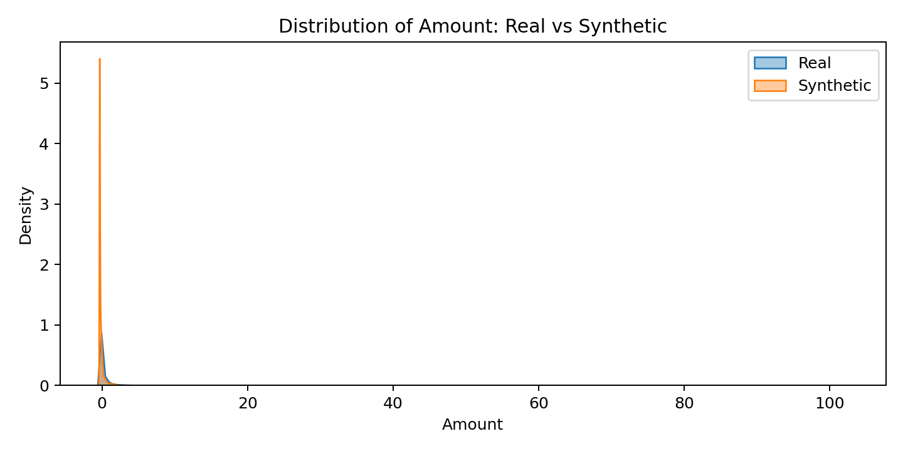

# 🧪 Synthetic Data Generation for Privacy-Preserving ML

## 📌 Project Overview
This project explores **synthetic data generation** using **CTGAN** for privacy-preserving machine learning.  
We use the **Credit Card Fraud dataset** (from [Kaggle](https://www.kaggle.com/datasets/mlg-ulb/creditcardfraud)), which is highly imbalanced and sensitive.  

The goal is to:
- Generate **realistic but privacy-safe synthetic data**
- Compare model performance trained on **real vs synthetic vs hybrid data**
- Evaluate privacy risks with **nearest-neighbor analysis**
- Visualize how synthetic data distributions match real data

---

## ⚙️ Methodology
1. **Data Preparation**  
   - Preprocessed and scaled the dataset  
   - Train-test split (80/20)  

2. **Synthetic Data Generation**  
   - Trained a CTGAN synthesizer (`sdv` library)  
   - Generated synthetic dataset with same shape as real  

3. **Utility Evaluation**  
   - Compared classifiers trained on:
     - Real data
     - Synthetic data
     - Hybrid (real negatives + synthetic positives)  

4. **Privacy Evaluation**  
   - Nearest-neighbor distance check (synthetic vs real records)  

5. **Visualization**  
   - Plotted feature distributions (real vs synthetic)  
   - Histogram of nearest-neighbor distances  

---

## 📊 Key Results

### 🔹 Utility Evaluation

**Train on Real (baseline):**

| Class | Precision | Recall | F1-score | Support |
|-------|-----------|--------|----------|---------|
| 0     | 0.9997    | 0.9999 | 0.9998   | 56864   |
| 1     | 0.9419    | 0.8265 | 0.8804   | 98      |

**ROC AUC:** 0.9623  

---

**Train on Synthetic:**

| Class | Precision | Recall | F1-score | Support |
|-------|-----------|--------|----------|---------|
| 0     | 0.9998    | 0.9839 | 0.9918   | 56864   |
| 1     | 0.0868    | 0.8878 | 0.1582   | 98      |

**ROC AUC:** 0.9652  

---

**Hybrid (real negatives + synthetic frauds):**

| Class | Precision | Recall | F1-score | Support |
|-------|-----------|--------|----------|---------|
| 0     | 0.9988    | 0.9999 | 0.9993   | 56864   |
| 1     | 0.8182    | 0.2755 | 0.4122   | 98      |

**ROC AUC:** 0.9449  

---

### 🔹 Privacy Evaluation (Nearest-Neighbor Distances)

- Min: **1.4385**  
- 25%: **3.5252**  
- Median: **4.3770**  
- Mean: **6.1002**  
- 75%: **7.4857**  
- Max: **26.0296**  

👉 No synthetic record was “too close” to real ones → **privacy preserved** ✅

---

## 📷 Sample Visuals

**Distributions (Real vs Synthetic)**  
- Amount  
  

- V1  
  

- V2  
  

- V3  
  

**Privacy Check Histogram**  
- Distances between synthetic and nearest real samples  
  

---

